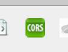

# Iot Device Simulator

### Info

This package can be used to deploy an IoT device simulator on your local machine. Can be used in conjunction with SDS to build demo's and prototypes.

### Use

1. First of all install nodejs from the following location: [Node.js](https://nodejs.org/en/)

   Download the stable version (recommended for most users). Follow the Wizard.
   
   To test if everything is working, open a command prompt and type (if you already had a prompt open, close it first):
   ```
    $ node --version
   ```
   
   If you get an error, uninstall and install again.
   
2. Download Git from following location: [Git](https://git-scm.com/downloads)

   Follow the wizard (When asked if you want to add to your path, click yes).
   
   To test if everything is working, open a command prompt and type (if you already had a prompt open, close it first):
   ```
    $ git --version
   ```
   If you get an error, uninstall and install again.
   
3. Navigate to a folder on your local machine where you want to store the application.

4. Open a command prompt and navigate to that specific folder (to get the path, just copy paste it from the finder window):
   ```
    $ cd <path/to/folder> // omit the <>
   ```
5. Clone the project into the folder iot-device-simulator and move into the folder on the command Prompt:
    ```
    $ git clone https://github.com/Temmermans/iot-device-simulator.git iot-device-simulator && cd iot-device-simulator
    ```
6. Install all the necessary libs via the following command:
    ```
    $ npm install
    ```
7. Start the local server with the following command:
    ```
    $ npm run dev
    ```
8. Navigate to the following url on the localhost: [localhost](http://localhost:3000/simulator)

If you an access-Control-Allow-Origin error install following chrome extension: Allow-Control-Allow-Origin and enable it, make sure the icon is green and then try again.
If using other sites, makes sure to turn it off again.



### ToDo

- Add support for more than SAP SDS
- add ES6 to build flow
- Clean up code
- Form Validation
- Document Walkthrough
- If no pictures are selected, give default
- ...
